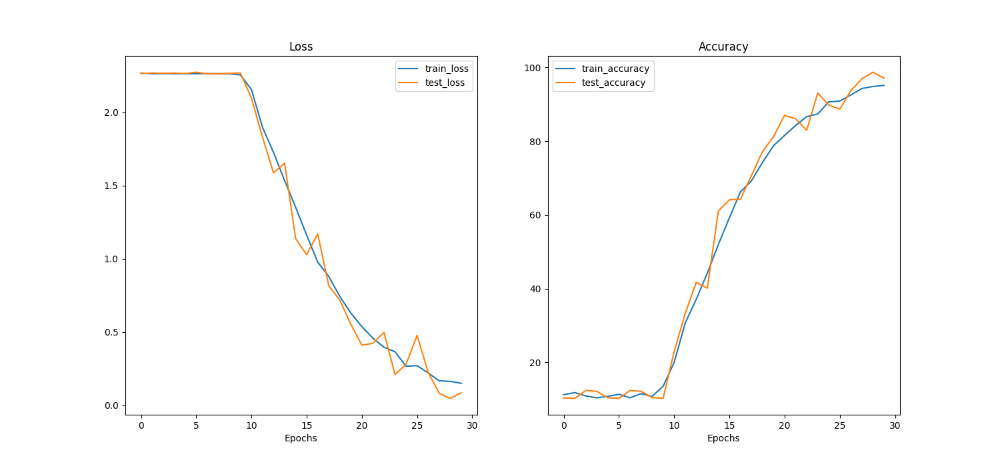

# ML assignment solution

Authors: 
    Oleh Pomazan <oleh.pomazan@ue-germany.de> 31566448

Files:
 - report.ipynb: main solution with explanations 
 - knn.py: implementation of k-nearest neighbors classification in Numpy
 - features.py: audio features extraction code using librosa library
 - model.py: implementation of VGG11 CNN for spectrogram classification
 - dataset.py: PyTorch datasets and dataloaders
 - train.py: training VGG1 using spectograms

## Dataset:

In order to train VGG11 model download Urban8kSound dataset into `input` directory:

```
input
├── audio
├── FREESOUNDCREDITS.txt
├── metadata
└── UrbanSound8K_README.txt
```

Pre-trained weights for VGG11 model and `extracted_features.csv/.pcl` are in `data` directory.

Training loss and accuracy 
